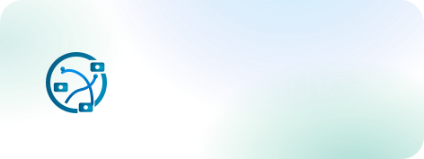

<div align="center">
  <p>
    
  </p>
</div>

<div align="center">

[](https://github.com/playbox-dev/trackstudio/actions/workflows/lint.yml)
[](https://python.org)
[](LICENSE)
[](https://github.com/astral-sh/ruff)

</div>

<h4 align="center">
    <p>
        <b>English</b> |
        <a href="i18n/README_ja.md">日本語</a>
    </p>
</h4>

## What is Track Studio?

**Multi-Camera Multi Object Tracking System with Live Camera Streams**

A real-time multi-camera object detection and tracking system with WebRTC streaming, computer vision integration, and Bird's Eye View (BEV) transformation capabilities. It is designed to be modular and extensible, allowing you to easily add your own trackers and mergers.


## Features

- 🎥 **Multi-Camera Support** - Process multiple RTSP streams simultaneously
- 🤖 **Detection and Tracking** - Defaults to RFDETR detection and DeepSORT tracking
- 🌐 **WebRTC Streaming** - Low-latency browser-based viewing
- 🎯 **Cross-Camera Merging** - Track objects across multiple camera views
- 🏗️ **Extensible** - Plugin system for custom trackers and mergers
- 🚀 **Easy to Use** - Simple Python API inspired by Gradio

## Requirements

- Python 3.10+
- CUDA-capable GPU (recommended)
- FFmpeg with hardware acceleration support
- RTSP streams or cameras

## Installation

```bash
# Install from github
pip install git+https://github.com/playbox-dev/trackstudio.git
```

For development:
```bash
git clone https://github.com/playbox-dev/trackstudio
cd trackstudio
pip install -e .
# or if using uv (recommended)
uv sync --dev
```

## Using with Thinklet Cube
Thinklet Cube is a small, highly durable, and low-power device that can be used to stream video to the MediaMTX server using RTMP over WiFi or 4G LTE. Visit [Fairy Devices](https://mimi.fairydevices.jp/technology/device/thinklet_cube/) for more information.
For this setup, we use a Thinklet Cube to stream video to the MediaMTX server using RTMP over Local Network through a wifi connection. You will need two or more Thinklet Cube connected to the same wifi network, adb to connect to the Thinklet Cube, and a PC with a GPU. Detailed instructions on installing adb and connecting to the Thinklet Cube can be found in [Thinklet Developer Portal](https://fairydevicesrd.github.io/thinklet.app.developer/docs/startGuide/startGuide).

### Steps
```bash
# 1. Start MediaMTX server
docker compose up -d mediamtx

# 2. Connect the Thinklet Cube to the PC and run these commands to start streaming video to the MediaMTX server
adb -s <Device ID for camera0 (shown using adb devices)> shell am start \
    -n ai.fd.thinklet.app.squid.run/.MainActivity \
    -a android.intent.action.MAIN \
    -e streamUrl "rtmp://<server IP>:1935" \
    -e streamKey "camera0" \
    --ei longSide 720 \
    --ei shortSide 480 \
    --ei videoBitrate 1024 \
    --ei audioSampleRate 44100 \
    --ei audioBitrate 128 \
    --ez preview false

adb -s <Device ID for camera1 (shown using adb devices)> shell am start \
    -n ai.fd.thinklet.app.squid.run/.MainActivity \
    -a android.intent.action.MAIN \
    -e streamUrl "rtmp://<server IP>:1935" \
    -e streamKey "camera1" \
    --ei longSide 720 \
    --ei shortSide 480 \
    --ei videoBitrate 1024 \
    --ei audioSampleRate 44100 \
    --ei audioBitrate 128 \
    --ez preview false

# 3. Start streaming: Press the middle button on the Thinklet Cube to start streaming.

# 4. Run TrackStudio with test config
trackstudio run -c test_config.json --vision-fps 10

# 5. Open http://localhost:8000 in your browser
```


## Testing with Local Videos

For testing without real cameras, use ffmpeg to publish RTSP test streams:
Assumes 2 videos are inside the `tests/videos` directory with names `cam1.mp4` and `cam2.mp4`. You can change the video files in the `stream_camera0_ffmpeg.sh` and `stream_camera1_ffmpeg.sh` scripts.
We tested with videos from [Large Scale Multi-Camera Tracking Dataset](https://www.kaggle.com/datasets/aryashah2k/large-scale-multicamera-detection-dataset) [1].

```bash
# 1. Start MediaMTX server
docker compose up -d mediamtx

# 2. Create test streams
./test_mediamtx.sh

# 3. Run TrackStudio with test config
trackstudio run -c test_config.json

# 4. Open http://localhost:8000 in your browser
```

This creates two test streams at:
- `rtsp://localhost:8554/camera0`
- `rtsp://localhost:8554/camera1`

To stop: `docker compose down`


## 🚀 Quick Start

### Python API

```python
import trackstudio as ts

# Launch with default settings
app = ts.launch()

# Custom configuration
app = ts.launch(
    rtmp_streams=[
        "rtsp://localhost:8554/camera0",
        "rtsp://localhost:8554/camera1"
    ],
    camera_names=["Camera 0", "Camera 1"],
    tracker="rfdetr",
    server_port=8000,
)
```

### Command Line

```bash
# Start server with default config
trackstudio run

# Start with custom streams
trackstudio run --streams rtsp://localhost:8554/camera0 rtsp://localhost:8554/camera1

# Generate config file
trackstudio config --output my_config.json

# List available components
trackstudio list
```

## Configuration

TrackStudio can be configured via:
- Python API parameters
- Command line arguments
- JSON configuration files

Example configuration file:
```json
{
  "cameras": {
    "stream_urls": [
      "rtsp://localhost:8554/camera0",
      "rtsp://localhost:8554/camera1"
    ]
  },
  "vision": {
    "tracker_type": "rfdetr",
    "merger_type": "bev_cluster",
    "fps": 10.0
  },
  "server": {
    "host": "0.0.0.0",
    "port": 8000
  }
}
```

## Custom Trackers

Create custom trackers with auto-registration - **no need to modify any existing files!**

### Step 1: Create Your Tracker Configuration

```python
from trackstudio.vision_config import register_tracker_config, BaseTrackerConfig, slider_field
from pydantic import Field

@register_tracker_config("mytracker")  # Auto-registers with the system!
class MyTrackerConfig(BaseTrackerConfig):
    """Configuration for my custom tracker"""
    detection_threshold: float = slider_field(
        0.5, 0.1, 1.0, 0.1,
        "Detection Threshold",
        "How confident detections need to be"
    )
    max_tracks: int = Field(default=50, title="Max Tracks")
```

### Step 2: Create Your Tracker Class

```python
from trackstudio.tracker_factory import register_tracker_class
from trackstudio.trackers.base import VisionTracker
import numpy as np

@register_tracker_class("mytracker")  # Auto-registers with the factory!
class MyTracker(VisionTracker):
    def __init__(self, config: MyTrackerConfig):
        super().__init__(config)
        self.config = config

    def detect(self, frame: np.ndarray, camera_id: int):
        # Your detection logic here
        detections = []
        return detections

    def track(self, detections, camera_id: int, timestamp: float, frame=None):
        # Your tracking logic here
        tracks = []
        return tracks
```

### Step 3: Use Your Tracker

```python
# That's it! Your tracker is now available system-wide
app = ts.launch(tracker="mytracker")
```
An example of a custom tracker can be found in [custom_tracker_examples/demo.py](custom_tracker_examples/demo.py).

## Architecture

TrackStudio uses a modular architecture:

- **Vision Pipeline**: Detection → Tracking → BEV Transform → Cross-Camera Merging
- **Streaming**: RTMP Input → WebRTC Output with hardware acceleration
- **Web UI**: React-based interface with real-time visualization
- **Plugin System**: Register custom trackers and mergers

## Roadmap

-  Tracking trail visualization
-  Remove hardcoded image and canvas sizes in BEV canvas as well as input camera streams
-  Applications with tracking data
-  Detection class handling
-  Cloud deployment guides

## Contributing

We welcome contributions!

For developers:
- 📋 **[Development Guide](DEVELOPMENT.md)** - Setup, linting, and code quality tools
- 🧹 **Code Quality**: We use [Ruff](https://docs.astral.sh/ruff/) for linting and formatting
- 🔧 **Quick Setup**: Run `make dev-setup` to get started
- ✅ **Pre-commit Hooks**: Automatic code quality checks on commit

## References

[1] [Large Scale Multi-Camera Tracking Dataset](https://www.kaggle.com/datasets/aryashah2k/large-scale-multicamera-detection-dataset)

[2] [RF-DETR](https://github.com/roboflow/rf-detr)

[3] [DeepSORT: Simple Online and Realtime Tracking with a Deep Association Metric](https://arxiv.org/abs/1703.07402)


## License

TrackStudio is licensed under the Apache License 2.0. See [LICENSE](LICENSE) for details.

## Citation

If you use TrackStudio in your research, please cite:

```bibtex
@software{trackstudio,
  title = {TrackStudio: Multi-Camera Vision Tracking System},
  author = {Playbox},
  year = {2025},
  url = {https://github.com/playbox-dev/trackstudio}
}
```

## Support

- 📧 Email: support@play-box.ai
- 🐛 Issues: [GitHub Issues](https://github.com/playbox-dev/trackstudio/issues)

## 🔗 Links

- [Documentation](https://trackstudio.readthedocs.io/) # Coming soon
- [Thinklet Cube](https://mimi.fairydevices.jp/technology/device/thinklet_cube/)
- [PyPI Package](https://pypi.org/project/trackstudio/)
- [GitHub Repository](https://github.com/playbox-dev/trackstudio)
- [Example Notebooks](https://github.com/playbox-dev/trackstudio/tree/main/examples) # Coming soon

---
